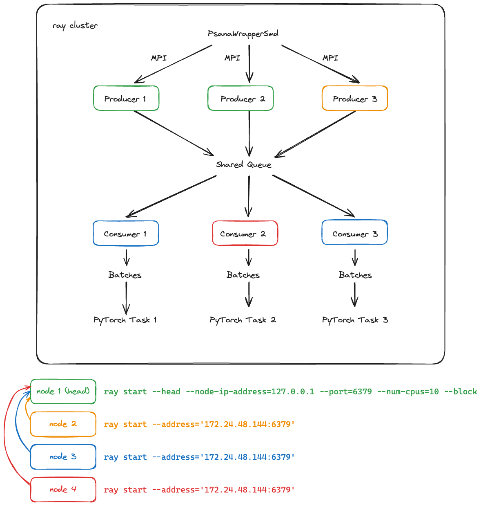

# Psana-Ray



## Install

```bash
pip install git+https://github.com/carbonscott/psana-ray
```

## Usages

1. **Launch Ray server on producer nodes:**
    ```bash
    ray start --head --node-ip-address=127.0.0.1 --port=6379 --num-cpus=10 --block
    ```

2. **Launch producer:**
    ```bash
    mpirun -n 4 psana-ray-producer --exp mfxl1038923 --run 58 --detector_name epix10k2M --queue_size 400
    ```

3. **Launch Ray server on consumer nodes:**
    ```bash
    ray start --address='<PRODUCER IP>:<PORT>'
    ```
   *The Ray server usually tells you which IP and port to connect to. For example:*
    ```bash
    ray start --address='172.24.48.144:6379'
    ```

4. **Launch consumer:**
    ```bash
    python psana_consumer.py 1
    ```

5. **Stop Ray server on consumer:**
    ```bash
    ray stop
    ```
